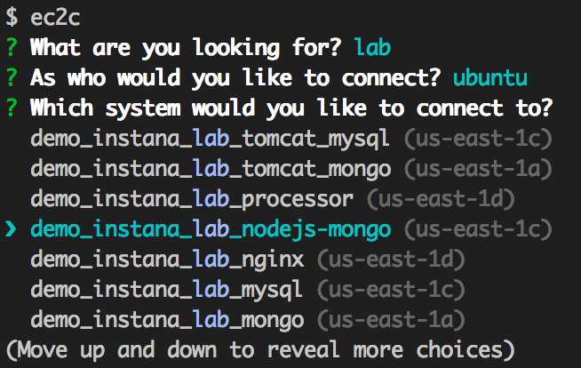

<h1 align="center">ec2c</h1>
<p align="center">Search and connect to EC2 instances via SSH - the easy way.</p>

## Introduction
Aren't you tired of looking up EC2 instances by name via the AWS console, the AWS CLI tools or custom scripts? Wouldn't it be great to just type in what you are looking for and get a list of EC2 instances that match your query and that you can connect to by hitting *enter*?

This is what *ec2c* (**ec2 c**onnect) was made for! *ec2c* retrieves a list of all running EC2 instances, applies fuzzy search on that list and makes it easy for you to pick just the instance that you need.

<p align="center">
  
</p>

## Installation
You will need a recent Node.js version such as Node.js v4 to use *ec2c*. If you have Node.js installed, you can install *ec2c* via the following command.

```
npm install -g ec2c
```

## Usage
*ec2c* comes with a CLI that be used via `ec2c`. Just type in `ec2c` and the command prompt will take you from there.

## Configuration
*ec2c* currently has limited configuration parameters. It assumes that defaults are what you want. In a future release private keys and EC2 credentials section may become configurable.

 - **Default User Name**: It is possible to define a default user name. To do so, specify it via an `EC2C_DEFAULT_USER_NAME` environment variable. For example, you could put the following into your `.bashrc`.

```
export EC2C_DEFAULT_USER_NAME='ubuntu'
```

## License (MIT)

Copyright (c) 2015 Ben Ripkens

Permission is hereby granted, free of charge, to any person obtaining a copy
of this software and associated documentation files (the "Software"), to deal
in the Software without restriction, including without limitation the rights
to use, copy, modify, merge, publish, distribute, sublicense, and/or sell
copies of the Software, and to permit persons to whom the Software is
furnished to do so, subject to the following conditions:

The above copyright notice and this permission notice shall be included in
all copies or substantial portions of the Software.

THE SOFTWARE IS PROVIDED "AS IS", WITHOUT WARRANTY OF ANY KIND, EXPRESS OR
IMPLIED, INCLUDING BUT NOT LIMITED TO THE WARRANTIES OF MERCHANTABILITY,
FITNESS FOR A PARTICULAR PURPOSE AND NONINFRINGEMENT. IN NO EVENT SHALL THE
AUTHORS OR COPYRIGHT HOLDERS BE LIABLE FOR ANY CLAIM, DAMAGES OR OTHER
LIABILITY, WHETHER IN AN ACTION OF CONTRACT, TORT OR OTHERWISE, ARISING FROM,
OUT OF OR IN CONNECTION WITH THE SOFTWARE OR THE USE OR OTHER DEALINGS IN
THE SOFTWARE.
